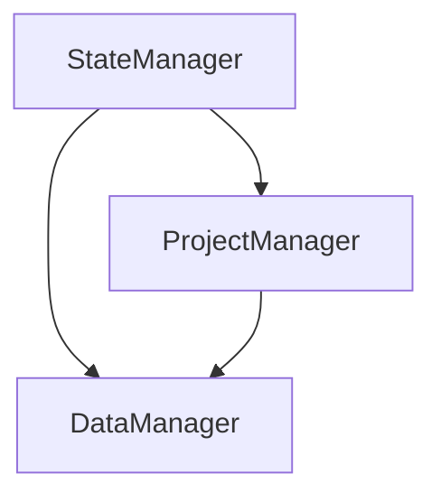
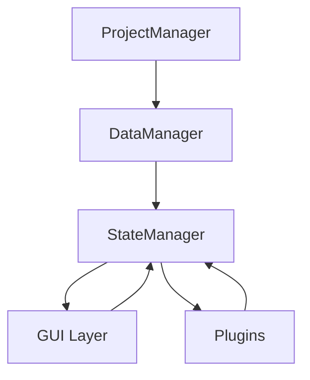

# MUS1 Architecture

## Overview
MUS1 is a behavioral analysis tool built to process DeepLabCut tracking data. The application follows a modular design with a plugin-based architecture for extensible analysis methods.

## 1. Core Components

### a. General Idea 
> This is also incomplete and we need to think more broadly and integrate previous build attempt lessons 



### b. Description of Roles 
#### StateManager: Central source of truth for application state
- Manages subject metadata and experiment data
- Handles state updates and validation
- Emits state change events

#### ProjectManager: Handles project lifecycle
- Project creation and loading
- File access
- Configuration interface

#### DataManager: Manages data operations
- DLC data loading and processing
- File I/O operations
- Data validation and integrity checks
- File structure management

#### BasePlugin: Abstract base class for analysis plugins
- Defines interface for analysis methods
- Handles parameter validation
- Manages analysis results

#### Analysis Plugins: Implement specific analysis methods
- Novel Object Recognition (NOR)
- Open Field Analysis (OFA)
- DLC model performance analysis

## 2. Data Flow
> **Implementation Status**: [Phase 2.1](ROADMAP.md#21-data-import)

### a. General Data Flow



### b. Detailed Flow Description

1. **Project Level**
   - ProjectManager handles project structure and file organization
   - Creates standardized directory structure
   - Manages config.yaml and metadata.json files

2. **Data Level**
   - DataManager loads and validates raw data
   - Processes DLC tracking files
   - Handles image file management
   - Performs initial data validation

3. **State Level**
   - StateManager maintains application state
   - Emits state change signals
   - Manages MouseMetadata and ExperimentData
   - Coordinates between GUI and data layers

4. **Analysis Level**
   - Plugins receive validated data from StateManager
   - Process data according to specific analysis methods
   - Return results to StateManager
   - StateManager notifies GUI of new results

5. **GUI Level**
   - Receives state updates from StateManager
   - User interactions trigger state changes via StateManager
   - MethodsExplorer configures plugin parameters
   - ProjectView displays project structure and results

### b. Project Organization

#### Source Code Structure
```
mus1/
├── docs/
│   ├── ARCHITECTURE.md          # This document
│   ├── ROADMAP.md              # Development timeline
│   └── README.md               # Project overview
├── mus1/
│   ├── __init__.py             # Package initialization
│   ├── __main__.py             # Application entry point
│   ├── core/
│   │   ├── __init__.py
│   │   ├── state_manager.py    # Central state management
│   │   ├── project_manager.py  # Project file/data handling
│   │   └── data_manager.py     # Data processing and analysis
│   ├── gui/
│   │   ├── __init__.py
│   │   ├── main_window.py      # Main application window
│   │   ├── widgets/
│   │   │   ├── __init__.py
│   │   │   ├── base_widget.py        # Base widget class
│   │   │   ├── methods_explorer.py   # Analysis parameter testing
│   │   │   └── project_view.py       # Project navigation
│   │   └── dialogs/
│   │       ├── __init__.py
│   │       └── startup_dialog.py      # Initial project setup
│   └── plugins/
│       ├── __init__.py
│       ├── base_plugin.py            # Plugin interface definition
│       └── nor/                      # Novel Object Recognition plugin
│           ├── __init__.py
│           └── nor_analysis.py
├── tests/                      # Test suite
├── setup.py                    # Package installation
├── requirements.txt            # Dependencies
└── .gitignore                 # Git ignore rules
```

### c. Data Organization

### a. Project Structure
```
project_directory/
├── config.yaml                # MUS1 project configuration
├── subjects/                  # Subject data
│   └── mouse_id/             # Mouse-specific data
│       ├── metadata.json      # Mouse metadata
│       └── experiments/       # Experiment data
│           └── YYYY-MM-DD_type/
│               ├── dlc_data/        # DLC project reference
│               │   ├── config.yaml  # DLC config reference
│               │   └── model/       # DLC model reference 
│               ├── tracking.csv     # DLC tracking data
│               ├── arena.png        # Arena image
│               ├── arena_zones.json # Zone definitions
│               └── analysis/        # Analysis results
├── dlc_projects/             # DLC Project references
│   └── project_name/         # Symlinks to DLC project
│       ├── config.yaml       # DLC configuration
│       ├── dlc-models/       # Model files
│       └── labeled-data/     # Training data
└── plugins/                  # Analysis plugins
```

### b. DLC Integration Flow

1. **Project Creation**
   - User creates new MUS1 project
   - Links existing DLC project
   - System validates DLC project structure
   - Creates references to DLC files

2. **Experiment Import**
   - User selects DLC tracking files
   - System:
     - Validates against DLC config
     - Copies/links relevant DLC data
     - Creates experiment structure
     - Maps tracking points to analysis zones

3. **Data Validation**
   - Verify tracking point names match DLC config
   - Validate coordinate data format
   - Check arena image compatibility
   - Ensure model files are accessible

4. **Analysis Pipeline**
   - Load DLC tracking data
   - Map to experiment configuration
   - Apply selected analysis methods
   - Store results in experiment directory

### c. Configuration Management

1. **DLC Project Reference**
```yaml
dlc_projects:
  project_name:
    path: "/path/to/dlc/project"
    config: "config.yaml"
    model_version: "iteration-0"
    bodyparts:
      - 
      - 
      - 
    objects:
      - 
      - 
```

2. **Experiment Configuration**
```yaml
experiment:
  type: "nor"
  dlc_project: "project_name"
  tracking_file: "path/to/tracking.csv"
  arena_image: "path/to/arena.png"
  zones:
    familiar_object: 
      reference: "Silo"
      shape: "circle" #circle, rectangle, polygon, square 
      radius: 100
    novel_object:
      reference: "Diamond"
      shape: "circle" #circle, rectangle, polygon, square 
      radius: 100
```

### b. Data Flow Diagram


### c. Alignment with DLC
MUS1 aligns with DeepLabCut's data organization by:
1. Using DLC tracking CSV format directly
2. Organizing experiments by date and type
3. Maintaining clear separation between data and analysis
4. Supporting plugin-specific configurations

graph TD
    A[MUS1 Project] --> B[config.yaml]
    A --> C[subjects/]
    C --> D[subject_id/]
    D --> E[metadata.json]
    D --> F[experiments/]
    F --> G[YYYY-MM-DD_type/]
    G --> H[tracking.csv]
    G --> I[arena.png]
    G --> J[analysis/]
    A --> K[plugins/]
    K --> L[nor/settings.yaml]


This structure allows:
- Direct use of DLC outputs
- Clear experiment organization
- Standardized analysis workflow
- Extensible plugin system

## 3. Package Organization and Imports

### Import Structure

#### a. Overview 
```
mus1/
├── __init__.py       # Exposes core components and version
├── core/
│   ├── __init__.py  # Exposes core classes (StateManager, etc.)
│   └── ...
├── gui/
│   ├── __init__.py  # Exposes main GUI components
│   ├── widgets/
│   │   ├── __init__.py  # Exposes all widgets
│   │   └── ...
│   └── ...
└── plugins/
    ├── __init__.py  # Plugin registry and loading
    └── ...
```

#### b. Example of Import Structure Code 

##### Top-level Package (`mus1/__init__.py`):
```python
# Core imports
from mus1.core import StateManager, ProjectManager, DataManager

# GUI imports
from mus1.gui import MainWindow
from mus1.gui.widgets import MethodsExplorer

# Plugin imports
from mus1.plugins import register_plugin
from mus1.plugins.nor import NORPlugin

register_plugin(NORPlugin)
```

## 4. GUI Module Architecture

### a. Overview 
```
gui/
├── main_window.py      # Application's main window and central controller
├── widgets/           # Reusable UI components
│   ├── base_widget.py     # Common widget functionality
│   ├── methods_explorer.py # Analysis parameter testing interface
│   └── project_view.py    # Project navigation and management
└── dialogs/           # Modal interaction windows
    └── startup_dialog.py  # Project initialization
```

### b. Component Responsibilities

#### MainWindow
- Acts as the application's main controller
- Manages the application's layout and widget arrangement
- Coordinates communication between widgets
- Handles menu actions and toolbar operations

Example of main window code: 
```python
class MainWindow(QMainWindow):
    def __init__(self, state_manager: StateManager):
        self.state_manager = state_manager
        self.project_view = ProjectView(state_manager)
        self.methods_explorer = MethodsExplorer(state_manager)
        # MainWindow owns the primary instances of widgets
```

### c. Widgets
- Inherit from BaseWidget for common functionality
- Each widget is responsible for a specific aspect of the application
- Communicate with core components through state_manager
- Follow the Observer pattern for state updates

Example of base widget code: 
```python
class BaseWidget(QWidget):
    state_changed = Signal(str)  # Signal for state changes
    
    def update_from_state(self):
        """Update widget based on state changes"""
        pass
```

### d. Dialogs
- Handle modal interactions
- Provide focused interfaces for specific tasks
- Return results rather than modifying state directly

## 5. State Management Between Core and GUI 

### a. Signal Flow 
> This is incomplete and should outline the signal flow between core and gui more specifically 
```
StateManager (Core) <-> MainWindow <-> Individual Widgets
```

### b. Widget Updates 
> Other specific explanations may be needed
- Widgets observe StateManager changes
- Updates flow down from StateManager through MainWindow
- User interactions flow up through signals

## 6. Best Practices

### a. Widget Independence
- Widgets should be self-contained
- Communication through signals/slots
- No direct widget-to-widget communication

### b. State Management
- Widgets don't modify state directly
- State changes go through StateManager
- Use signals for asynchronous updates

### c. Resource Management
- Widgets clean up their own resources
- Parent widgets manage child widget lifecycle
- Use Qt's parent-child mechanism for memory management

### d. Error Handling
- Widgets handle their own UI-related errors
- Core errors propagate through StateManager
- User-friendly error messages in dialogs

## 7. Testing Strategy

### a. Widget Tests
- Test widget initialization
- Test signal emissions
- Test state update handling

### b. Integration Tests
- Test widget interactions
- Test state propagation
- Test error handling

### c. Visual Tests
- Test layout behavior
- Test widget appearance
- Test responsive design

